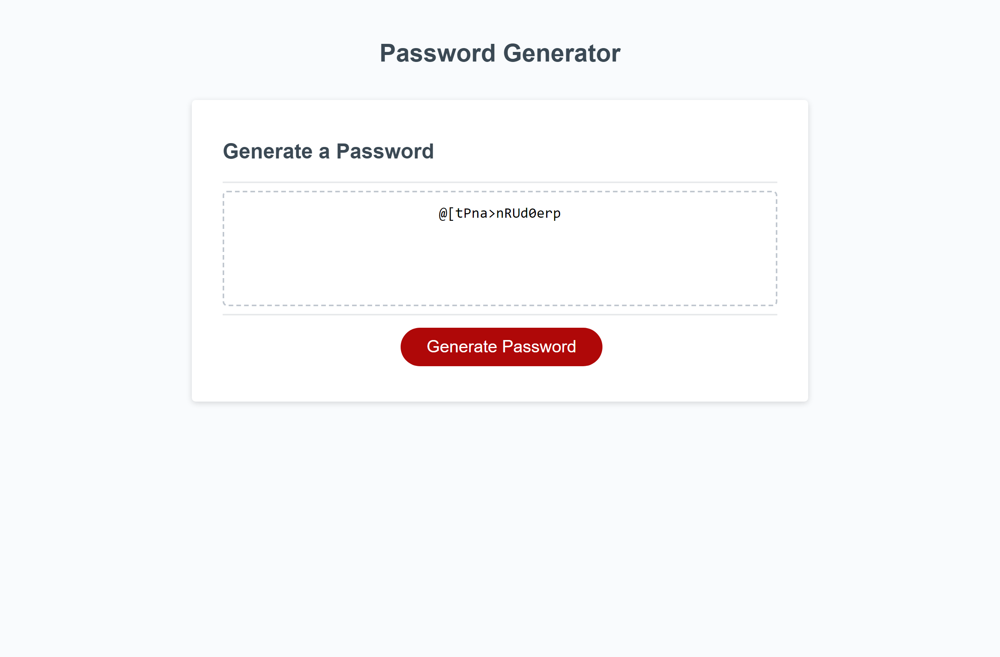

# password-generator

## Description

This app will run in the browser and will generate a random password using JavaScript code.

The app will prompt you for the password length and the option to include lowercase, uppercase, numberic and special characters.

The password length must be between 8 and 128 characters and you must select at least one character option.

## Deployed Application

https://colbyrobins.github.io/password-generator/

## Webpage Screenshot

